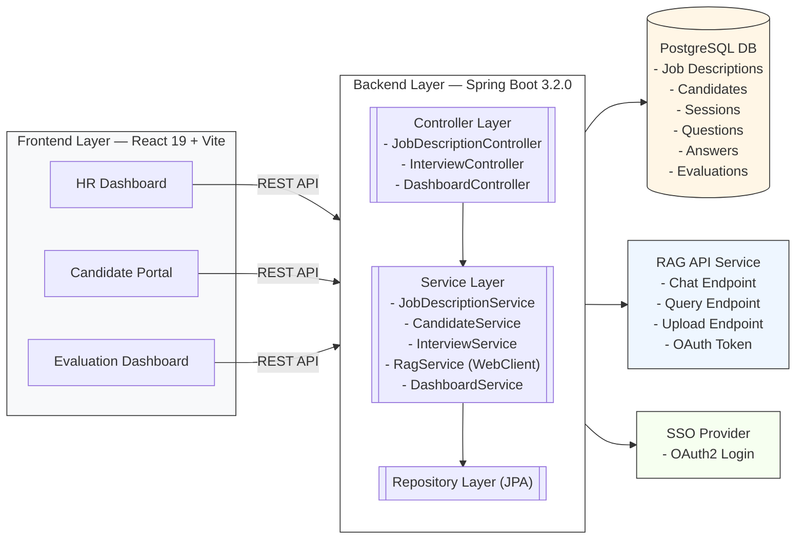

# HR Platform Architecture

> Markdown architecture document with a visual diagram (Mermaid) for the system you provided.

---

## Overview

A modern HR / Interview platform with a React frontend, a Spring Boot backend, PostgreSQL persistence, a RAG (Retrieval-Augmented Generation) API service for AI capabilities, and an SSO provider for OAuth2 login.

## Mermaid Visual Diagram

> **Note:** Renderers that support Mermaid (e.g., GitHub, VS Code Markdown Preview, many static site generators) will show this as a diagram.

---

## Component Responsibilities

### Frontend (React 19 + Vite)

* HR Dashboard: internal HR users manage roles, job postings, and metrics.
* Candidate Portal: public-facing or invited candidates apply, schedule interviews, upload resumes.
* Evaluation Dashboard: interviewers and hiring managers review answers, rate candidates, and finalize assessments.
* Communicates with backend over REST (JSON + bearer token from SSO).

### Backend (Spring Boot 3.2.0)

* Controller Layer: expose REST endpoints for frontend.
* Service Layer: business logic, orchestration, and integration with external systems (RAG API, SSO).

  * `RagService` uses a non-blocking `WebClient` to call RAG API for AI-driven question generation, answer validation, or summarization.
* Repository Layer: JPA-based persistence to PostgreSQL.

### PostgreSQL

* Stores canonical application state: job descriptions, candidate profiles, interview sessions, Q&A, evaluations and audit/history.
* Should use proper indexing (e.g., by candidate id, session id, created_at) and partitioning if size grows large.

### RAG API Service

* Handles heavy AI/embedding/index responsibilities externally.
* Backend calls RAG endpoints for chat-like flows, retrieval queries, and content uploads.
* Protect with OAuth token exchange or client credentials; do not expose API keys to the browser.

### SSO Provider

* OAuth2-based authentication (authorization code flow for web apps).
* Issue JWT or opaque access tokens used by frontend and backend.

---

## Data Flow (high level)

1. User logs in via SSO (Authorization Code Flow). Frontend receives short-lived token.
2. Frontend calls Backend controllers with the token in `Authorization: Bearer <token>`.
3. Controllers validate/parse token (or delegate to an auth filter) and call Services.
4. Services call Repositories to read/write database; when AI assistance is required, `RagService` calls the external RAG API.
5. The RAG API returns results; the Service enriches responses, persists relevant artifacts, and returns to Controller → Frontend.

---

## Non-functional Requirements & Recommendations

* **Security:** Use OAuth2 + TLS everywhere; validate and rotate secrets; adopt least privilege for RAG API creds.
* **Scalability:** Run backend services behind a load balancer; use connection pooling for PostgreSQL; consider read-replicas for read-heavy dashboards.
* **Observability:** Add structured logging, distributed tracing (e.g., OpenTelemetry), and metrics (Prometheus + Grafana).
* **Resilience:** Circuit-breaker and retry for RAG API calls (Resilience4j or Spring Cloud Circuit Breaker).
* **Data retention:** Archive or partition audit and session data older than 12–24 months.

---

## Deployment (suggested)

* Frontend: Static hosting (Netlify, Vercel, S3+CloudFront) or containerized behind CDN.
* Backend: Containerized Spring Boot services deployed to Kubernetes (or ECS) with horizontal autoscaling.
* Database: Managed PostgreSQL (RDS/Cloud SQL) with automated backups and Multi-AZ.
* Secrets: Store in Vault / Secrets Manager.

---

## Files included

* `HR-Platform-Architecture.md` (this file)
* The Mermaid block above can be copied into any Mermaid-aware renderer to view the visual diagram.

---

*If you'd like, I can also export this as a standalone `.md` file with images (SVG export of the Mermaid) or generate a PlantUML diagram instead.*
